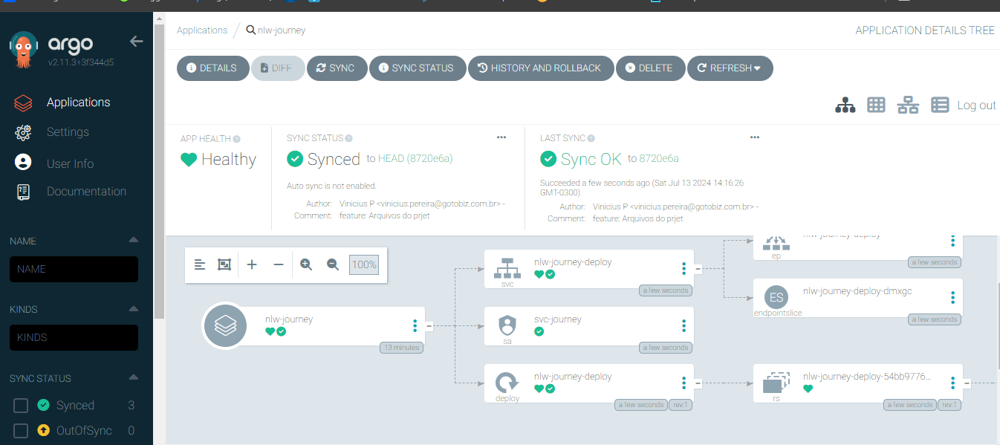

# NLW Journey DevOps

## Descrição
Este meu repositório criado durante a trilha DevOps da NLW Journey. Ele contém um projeto escrito em Golang, estruturado para exemplificar boas práticas de desenvolvimento e implantação contínua utilizando diversas ferramentas DevOps.

## Ferramentas e Tecnologias
A trilha DevOps deste projeto inclui o uso das seguintes ferramentas e tecnologias:
- **Docker**: Para criação e gerenciamento de containers.
- **Kubernetes**: Para orquestração de containers.
- **ArgoCD**: Para Continuous Deployment (CD).
- **Golang**: Linguagem de programação usada no desenvolvimento do projeto.
- **Kubernetes Lens**: Para visualização e gerenciamento de clusters Kubernetes.
- **K9S**: Ferramenta de linha de comando para gerenciamento de clusters Kubernetes.
- **GitHub Actions**: Para pipelines de Continuous Integration/Continuous Deployment (CI/CD).

## Estrutura do Projeto

- **cmd/journey**: Contém o código principal da aplicação.
- **internal**: Módulos internos e funções auxiliares.
- **scripts**: Scripts úteis para automação e setup do projeto.
- **.env**: Arquivo de configuração de variáveis de ambiente.
- **Dockerfile**: Definição da imagem Docker para a aplicação.
- **README.md**: Este arquivo.
- **docker-compose.yaml**: Configuração do Docker Compose para orquestração de múltiplos containers.
- **gen.go**: Código gerado.
- **go.mod**: Gerenciamento de dependências do Go.
- **go.sum**: Checksum das dependências.
- **.github/workflows**: Definições de pipelines com GitHub Actions.

## Requisitos

- Golang 1.XX ou superior
- Docker 20.10 ou superior
- Docker Compose 1.29 ou superior
- Kubernetes
- ArgoCD
- K9S ou Kubernetes Lens

ARGOCD
